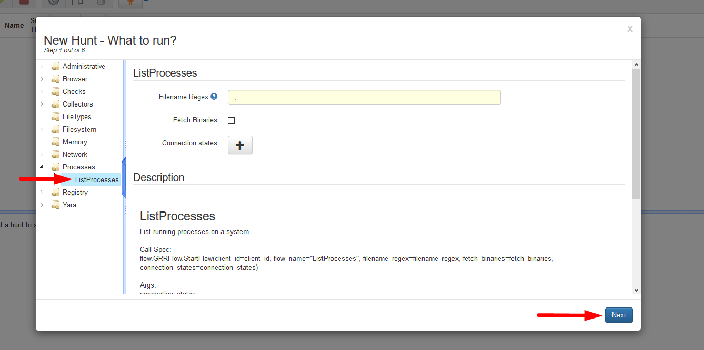
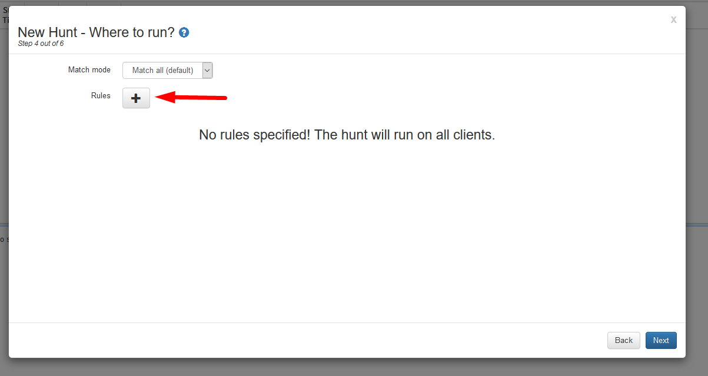

Google Rapid Response (GRR)
===========================

    Author: Farr, Collin
    Contact: collinfarr2@gmail.com
    Purpose: To inform on the building and use of Google Rapid Response

### License
`Copyright (C) 2018, Collin Farr <Collinfarr2@gmail.com>.   
Permission is granted to copy, distribute and/or modify this document under the
terms of the GNU Free Documentation License, Version 1.3 or any later version
published by the Free Software Foundation; with no Invariant Sections, no
Front-Cover Texts, and no Back-Cover Texts. A copy of the license is included
in the section entitled "GNU Free Documentation License".`

GRR Rapid Response is an incident response framework focused on remote live forensics. It consists of a python client (agent) that is installed on target systems, and python server infrastructure that can manage and talk to clients. The goal of GRR is to support forensics and investigations in a fast, scalable manner to allow analysts to quickly triage attacks and perform analysis remotely.

## Creating GRR From Install:
-------
##### Installing OS (Red Hat Enterprise Linux *Version - 6.9 & <*)

1. Download the RHEL v.X.x Binary DVD From: `https://access.redhat.com/downloads/content/69/ver=/rhel---7/7.5/x86_64/product-software`

2. Create a new virtual machine (VM) template with desired virtualization software using Binary DVD.iso
 * Be sure to allocate enough resources for GRR depending on size of desired deployment (i.e. if deploying to 20+ endpoint hosts be sure to make the hard drive space large enough to be able to store all hunts).

3. Once the VM is booted a few configuration changes need to be made:

  1. `Date/Time` should be set to Coordinated Universal Time (UTC).

  2. Under the `Installation Source` section:
Verify the media the install is coming from.
    * Be sure the media is selected before continuing.

  3. Under “Software Selection”:
    * “Minimal Install” should be selected along with the add-ons “Development Tools” and “Compatible Libraries”.

  4. Verify “Installation Location” is correct. (It should be the virtual disk from the creation of the VM.

  5. Under “Network & Hostname” check to be sure the ethernet interface is present. These settings will be configured later.

  6. Hit Next to start the install of the operating system.
    * Be sure to verify that the root account password is set.

##### Configuring Red Hat For GRR

1. Determine the name of the network interface for the VM (usually along the lines of eth0 or ens33)
        #ip addr

2. Configure the configuration file for that interface.
        #vi /etc/sysconfig/network-scripts/ifcfg-<interface_name>

3. The following configurations should replace what is already in the config file.
        DEVICE=<interface_name>
        BOOTPROTO= |none , static|
        ONBOOT=yes
        PREFIX=24
        IPADDR=<Static Ip Address in form of x.x.x.x>
        NETWORK=<Network Range in form of x.x.x.0>
        NETMASK=<255.255.255.0>
        GATEWAY=<Default Gateway in form of x.x.x.1>
4. Save this file and exit vi
        :wq!
5. Using ifdown and ifup restart the interface.
        #ifdown <interface_name>
        #ifup <interface_name>
5. Edit Resolv.conf file to add nameservers.
        #vi /etc/resolv.conf
6. Add the following to the configuration file
        nameserver 8.8.8.8
        nameserver 8.8.4.4
7. Check for network connectivity by pinging the default gateway and then external network
  * *NOTE* To check for external network connectivity pinging Google’s DNS is always a safe option. (8.8.8.8)
8. Configure RHEL to utilize repositories.
    1. Register The RHEL Instance.
            #subscription-manager register
            User:
            Password:
    2. Download and configure the Epel-repo.
            #rpm -ivh https://dl.fedoraproject.org/pub/epel/epel-release-latest-7.noarch.rpm
            # yum update
9. Configure the firewall to allow HTTP connections to the VM.
  1. Check to see if firewalld is running using
          #firewall-cmd --state
  2. Once verified the firewall is running check the allowed services for “HTTP”
          #firewall-cmd --get-services | grep http
  3. If http is not allowed add to list of services and make persistent using using:
        #firewall-cmd --add-service=http
        #firewall-cmd --runtime-to-permanent
  4. If http is allowed continue.
  5. Add the GRR web interface ports to allowed ports list.
          # firewall-cmd --add-port=8000/tcp
          # firewall-cmd --add-port=8080/tcp
          # firewall-cmd --runtime-to-permanent

##### Installing GRR (using pip).
1. Using Yum install the needed dependencies:
        # yum install -y epel-release python-devel wget which libffi-devel
        openssl-devel zip git gcc gcc-c++ redhat-rpm-config

        # yum install -y python-pip
2. Using pip install grr-response-server:
        # pip install grr-response-server

##### Configuring GRR.
1. Create the initial GRR configuration file
        # grr_config_updater initialize
      * The RSA Keys will automatically generate for GRRs configurations.
2. Choosing a(n) SQL version.
        #1
        <Enter>
3. Configure the Datastore Location. (The default is fine but is able to be changed)
        <Enter>
4. If using a unique hostname, enter that next.
        <Enter>
5. Frontend and Admin UI server URL. If using DNS to reach back to the GRR Server, add that domain here otherwise use the static ip that is set:
        http://x.x.x.x:8080/ (Front End)
        http://x.x.x.x:8000/ (Admin UI)
        <Enter>
6. If using a mail server to receive GRR alerts correctly input that information here
        <Enter>
7. Rekall is no longer supported, do not enable it.
        #n
        <Enter>
8. Adding The Admin user. (Set the admin users password)
        <password>
        <Enter>
9. Download Client Templates.
        #Y
        <Enter>
10. Repack the Client Templates.
        #Y
        <Enter>

##### Starting GRR to a Running State.

1. Using the commands added by GRR deploy the individual services.
  * Using the ‘&’ will run the command in the background
          #grr_admin_ui &
          #grr_worker &
          #grr_frontend &
2. Attempt to connect to the UI from a host within the network using the set addresses in the configuration file.
If Attempted connection fails:
    1. Attempt to Ping the GRR server to verify traffic gets to the destination.
    2. Double check the IP address of the Server against what is in the configuration.
    3. Attempt to Ping from the GRR Server out into the host team internal network.
    3. Double check that all firewalld rules and implementations have been set correctly.

##### Deploying GRR Agents.
`For Windows Operating systems (Psexec):`

1. Determine whether the hosts are 32 or 64 bit operating systems
2. Download the respective agent from the web ui.
  1. Under the configuration section select ‘Manage Binaries’

  2. Select the agent which fits your operating system

3. Create an IP list containing all the hosts you wish to deploy the GRR agent to.
4. Using psexec deploy the agents
        #psexec @<ip_list.txt> -u <username> -p <password> -c -f -s <agent_name>
      * NOTE: For an install without feedback from the agent use the ‘-d’ flag.
      * When using psexec, if the executable is not within the Command line environmental path an absolute path or browsing to the containing directory will be required.
      * A successful install will return an exit code of 0.
5. After successful deployment, be sure to add label to active hosts with a description of what they are.
    * Users, Services, SCADA, Etc.

`For Linux Operating Systems`

***COMING SOON***

##### Verify Agent communication with Server.

1. Using the GRR web ui, use the search bar at the top of the page.
  1. Leave search bar blank

  2. Press Enter
2. The Hosts communicating with the GRR server will be displayed in a list on this page.

3. If a host is not communicating as expected, use ping to determine if the host is active or not.

  * Determine point of failure if host is active but not calling back to the GRR server.
      * verify the GRRservice.exe is running in `tasklist` or `task manager`.
  * Can the host communicate with the frontend interface of grr using `http://x.x.x.x:8080/server.pem`
  

##### Conducting Analysis Using GRR.

* When starting analysis on one individual host, the analyst should start by interrogating the host for information. This will populate all of the unknown metadata about the host.

* Going forward, Hunts can be performed against the hosts. (for example: Task lists and Netstats)

  1. Running Netstats or Process List against hosts.
        1. Choose the 'Hunt Manager' tab and select the green + or 'Start new Hunt'
  
        2. Select either Network for `netstat` or Processes for  `tasklist`
          * For this demonstration we will be running a tasklist but the process is relatively the same for any other hunts.
        3. Select the ListProcesses option then select Next.
        
        4. Enter a description for the Hunt for it to be distinguished in the future then select 'Next'.
        
        5. Unless you have implemented Output plugins, select next.
        6. This next screen is the 'Match Mode' screen this is the where the Grr server will know which hosts you would like to run the hunt against. Select the '+' to add a new match case.
        
          1. There are multiple ways to set up the 'Match Cases'
            * By Operating Systems
            * By Labels made for the hosts
            * Or By 'Regex' which consists of multiple Cases.
          2. Choose the Regex option to run against specific IP addresses.
          
          3. Under field select `Space seperated list of host IP addresses`, and enter the IP address in the `Attribute Regex` field then select Next.
          
        4. After selecting 'Create Hunt', Select the Hunt and click start.
        
        8. After the Hunt has completed, Select the hunt again and at the bottom click `Results`
        
  2. Finding a File on a host.
    1. Choose the 'Hunt Manager' tab and select the green + or 'Start new Hunt'
    2. Select the `Filesystem` option, then `File Finder`.
    3. Enter the file path, and the action taken against this file then select Next.
    
    4. Enter a description for the Hunt for it to be distinguished in the future then select 'Next'.
    5. Unless you have implemented Output plugins, select next.
    6. This next screen is the 'Match Mode' screen this is the where the Grr server will know which hosts you would like to run the hunt against. Select the '+' to add a new match case.
    7. Choose the Regex option to run against specific IP addresses.
    8. Under field select `Space seperated list of host IP addresses`, and enter the IP address in the `Attribute Regex` field then select Next.
    4. After selecting 'Create Hunt', Select the Hunt and click start.
    8. After the Hunt has completed, Select the hunt again and at the bottom click `Results`
  3. Browsing the Filesystem of a host.
    1. After Selecting desired host, Click `Browse Virual Filesystem`. Then Select 'Os'
    
    2. This will go directly to the main directory where all drives installed on the device will be seen.
      * Note the listing will have to be refreshed to populate the folders and files within the drive.
      
